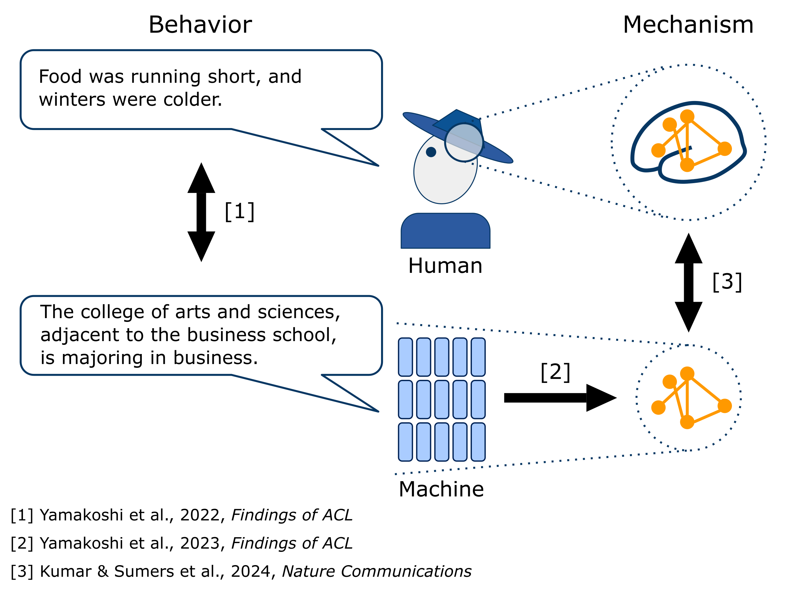

I'm a 5th year undergraduate student at the University of Tokyo, Faculty of Medicine.
I was an exchange student at Princeton University (2019-20) and I'm part of the UTokyo-Princeton Strategic Partnership (2022-23). 

My current research aims to identify the internal mechanisms of language processing by humans and machines.  
To this end, I have employed three different approaches.  
[1] Compare the linguistic behavior of language models against that of humans.  
[2] Identify the causal mechanism inside the language models.  
[3] Compare the internal representations of language models against neural recordings. 

I believe clarifying the detailed circuits inside language models and
aligning them with neural recordings will help us identify a more detailed language circuit inside the brain.

